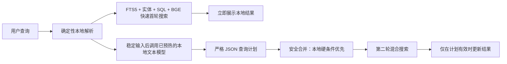

# 内置轻量文本搜索助手完整方案

## 一、任务目标

在不依赖云端接口、不读取图片或视频的前提下，为每次稳定输入的自然语言素材搜索增加实时介入的本地文本查询助手，并通过 GPU 加速降低查询理解等待时间。

助手只负责把用户口语补充为受约束的查询计划。日期计算、数据库访问、候选召回、硬条件过滤和最终排序继续由现有 C++ 搜索链路负责。

目标查询包括：

- `搜索一个月前的视频素材`
- `搜索红色牛仔裤`
- `找上周上海拍的竖屏视频`

## 二、不可突破的边界

1. 规则优先：可确定解析的日期、类型、结果域、OCR 原文和用户显式条件不能被模型覆盖。
2. 本地优先：应用启动后预热模型，但第一次搜索不等待模型；只有包含内容语义的查询才调用助手。
3. 文本专用：搜索助手不接收图片、缩略图、数据库行、文件绝对路径或候选素材 ID。
4. 失败可退化：模型缺失、启动失败、超时、输出非法或置信度不足时保留第一次本地结果。
5. 输出白名单：模型只能输出固定版本的 JSON 查询计划，不能输出 SQL、命令或自由格式控制信息。
6. GPU 专用：默认使用 Windows x64 Vulkan 版 llama.cpp；未检测到可用 GPU 时停用模型增强并保留本地搜索，不静默回落到慢速 CPU。

## 三、总体链路



## 四、技术选型

### 4.1 模型

- 默认模型：`Qwen3-0.6B-Q8_0.gguf`
- 上游：`Qwen/Qwen3-0.6B-GGUF`
- 模型文件大小：`639446688` 字节
- SHA-256：`9465E63A22ADD5354D9BB4B99E90117043C7124007664907259BD16D043BB031`
- 许可证：Apache-2.0

0.6B 用于受约束的中文查询计划，不承担开放问答。其质量必须通过项目查询回归集验证；后续如未达标，可无协议变更替换为 Qwen3-1.7B 量化模型。

### 4.2 推理运行时

- 运行时：llama.cpp `b10012`
- 资产：`llama-b10012-bin-win-vulkan-x64.zip`
- 压缩包大小：`33055657` 字节
- SHA-256：`3A3FD5965FAA434808B7AB945D2820DC23CE8237E8507A9F7719444C054696BB`
- 运行方式：应用私有 `llama-server.exe`，只监听 `127.0.0.1` 随机可用端口。

固定参数：

- 启动前用 `--list-devices` 探测 Vulkan GPU，`--n-gpu-layers 99` 将模型层卸载到 GPU
- 上下文 4096，保留未来配置上限但不默认使用 12K
- 单并发，短输出
- 禁用思考模式
- 应用主窗口加载完成后自动预热模型，禁用 llama.cpp 固定 120 秒睡眠
- 应用统一监听鼠标、键盘、触摸和快捷搜索活动；默认连续无操作 60 分钟后终止运行时并释放显存
- 用户恢复操作后自动重新预热；自动卸载时间支持 5–1440 分钟手动输入和常用时间下拉选择
- 应用退出时终止子进程

## 五、模块与文件清单

### 5.1 查询协议与可靠性

- `src/domain/SearchTypes.h`
  - 增加 `SearchReliabilityAssessment`。
  - 增加触发原因、分数和是否应调用助手。
- `src/core/search/SearchReliabilityEvaluator.h/.cpp`
  - 同时评估解析完整度和首轮检索质量。
- `src/core/search/NaturalLanguageQueryParser.cpp`
  - 补充一个月前、一个月之前、最近一个月等确定性日期表达。

### 5.2 模型客户端与运行时

- `src/infrastructure/search/SearchAssistantClient.h/.cpp`
  - 调用本机 OpenAI 兼容接口。
  - 固定系统提示、JSON Schema、低温度和最大输出。
  - 复用 `SearchQueryUnderstanding` 的白名单校验。
- `src/infrastructure/search/LocalSearchAssistantRuntime.h/.cpp`
  - 定位内置运行时和模型。
  - 选择回环端口、启动进程、探活、超时和退出清理。
  - 向调用方提供运行状态和本地端点。
- `src/application/ApplicationIdleMonitor.h/.cpp`
  - 汇总应用级键盘、鼠标、触摸和手势活动并维护空闲计时。
- `src/application/SearchAssistantLifecycleController.h/.cpp`
  - 负责启动预热、空闲卸载、恢复操作后重新加载和设置实时应用。

### 5.3 搜索编排

- `src/ui/viewmodels/MaterialCenterViewModel.h/.cpp`
  - 本地规则先快速返回首轮结果，不等待模型启动。
  - 每次非空内容查询稳定 400ms 后均请求本地助手，不再由可靠性分数决定是否介入。
  - 保留现有缓存、并发代次和失败回退。
  - 搜索期候选帧视觉复核已彻底移除，帧结果始终使用本地混合排序。

### 5.4 配置与界面

- `src/infrastructure/config/AppSettings.h/.cpp`
  - 保留内置文本查询助手开关、自动卸载分钟数和默认值。
  - 删除候选帧复核、搜索缩略图上传授权和已失去意义的“仅本地搜索”开关。
- `src/ui/viewmodels/SettingsViewModel.h/.cpp`
- `src/ui/qml/components/SettingsPage.qml`
  - 明确显示“内置文本查询助手”。
  - 显示实际 GPU 名称、本地运行、不读取图片和实时查询理解。
  - 提供 5–1440 分钟手动输入及 15/30 分钟、1/2/4/8 小时常用选项。
  - 明确视觉接口只用于素材导入与解析，不参与搜索。
- `src/ui/qml/workspaces/MaterialCenterWorkspace.qml`
- `src/ui/qml/components/QuickSearchWindow.qml`
  - 主界面和快捷搜索均提供“智能 / 视频 / 帧画面 / 图片 / 文档”结果快捷筛选。
  - 筛选通过搜索作用域覆盖结果域和素材类型，不是只在前端隐藏列表项。
- `src/ui/qml/components/MiddleDragScrollHandler.qml`
  - 使用鼠标中键按住拖动主要搜索列表、帧网格和详情滚动区。
  - 只接收中键，不影响原有左键选择、双击和按钮操作。

### 5.5 构建和发布

- `cmake/search-assistant-dependencies.lock.json`
- `cmake/PrepareSearchAssistantDependencies.cmake`
- `CMakeLists.txt`
- `CMakePresets.json`
- `tool/build_windows.ps1`
  - 显式准备、校验、复制并安装运行时和模型。
  - 模型不提交进 Git；构建缓存位于源码树外。
  - 安装包必须同时包含运行时和模型，缺一时拒绝打包。

## 六、实时介入与回退策略

### 6.1 不请求模型

- 空查询。
- 只有日期、素材类型、项目或结果域等确定性条件。

### 6.2 实时请求模型

- 查询中存在画面内容、实体、OCR 或其他自然语言内容条件。
- 本地结果是否为空、最高分是否足够，不再阻止模型介入。
- 输入采用短防抖，避免每个按键都排队一次模型调用。
- 相同日期、模型和查询文字复用内存缓存。

### 6.3 首轮与失败回退

- FTS5、结构化实体和 BGE 首轮搜索立即执行，界面不等待模型。
- 模型计划通过白名单、置信度和显式实体校正后执行第二轮搜索。
- 模型启动、超时或解析失败时保留首轮结果，不清空界面。
- `SearchReliabilityAssessment` 继续用于质量诊断和测试观测，不再作为模型调用门禁。

## 七、日期语义约定

- `一个月前`：参考日期减一个自然月，对应单日。
- `一个月之前`：从最早支持日期到参考日期减一个自然月的前一天。
- `最近一个月` / `近一个月`：参考日期减一个自然月到参考日期，包含首尾。
- `上个月`：上一个完整自然月，保持现有行为。

所有年月日由 Qt 日历运算计算，模型不能直接提交最终日期覆盖本地结果。

## 八、模型查询计划协议

协议沿用并收紧现有版本 1：

```json
{
  "version": 1,
  "result_target": "assets",
  "semantic_text": "红色牛仔裤",
  "lexical_terms": ["红色", "牛仔裤", "丹宁裤"],
  "asset_types": ["video"],
  "date": {
    "start": "",
    "end": "",
    "matched_text": "",
    "preferred_field": "any"
  },
  "folder_by_asset_criteria": false,
  "ocr_text": "",
  "entities": [
    {
      "label": "牛仔裤",
      "colors": ["红色"],
      "materials": [],
      "attributes": []
    }
  ],
  "confidence": 0.92,
  "explanation": "补充丹宁裤同义词"
}
```

合并规则：

1. 本地显式日期、类型和结果域始终优先。
2. 模型只能补充缺失实体和同义词。
3. 模型不能清空本地条件。
4. 模型不能把素材搜索改成文件夹或帧，除非用户原文明确表达且本地未识别。
5. 低于置信度阈值、字段越界或协议非法时整体拒绝。

## 九、测试计划

### 9.1 单元测试

- 日期：跨月、跨年、月底和闰年。
- 实时介入：确定性无内容查询不触发；所有内容查询触发并保留首轮回退。
- JSON：合法计划通过；未知类型、非法日期、超长字段和自由文本失败。
- 合并：本地硬条件不被覆盖。
- 运行时：资产缺失、端口选择、启动超时、重复启动和退出清理。
- 生命周期：启动自动预热、应用级空闲判定、超时卸载、恢复操作重新加载和设置边界。

### 9.2 模型真实回归

查询门控验证：

- `搜索一个月前的视频素材`

该查询必须完全由本地规则解析，不调用模型。使用内置模型执行以下查询并验证 JSON 与安全合并：

- `搜索红色牛仔裤`
- `找上周上海拍的竖屏视频`

### 9.3 全局回归

- CTest 全量通过。
- Windows MSVC Release RealWorkflow 构建成功。
- 安装暂存目录同时存在 `llama-server.exe`、依赖 DLL 和 GGUF。
- 离线启动应用后，本地助手能完成一次结构化查询理解。
- 关闭或破坏模型资产时，本地搜索仍正常。
- 搜索 ViewModel 不持有视觉客户端，视觉客户端不暴露查询理解或候选帧复核 API。

## 十、验收标准

- 检测到 Vulkan GPU 后才启动模型；无可用 GPU 时明确停用模型增强且不回落到 CPU。
- 模型在正常应用启动后自动预热；默认连续无操作 60 分钟后卸载并释放显存。
- 自动卸载时间支持 5–1440 分钟手动输入和 15/30 分钟、1/2/4/8 小时常用选项。
- 鼠标、键盘、触摸或快捷搜索活动恢复后自动重新预热。
- 所有包含内容语义的查询都会调用模型，纯日期/类型等确定性查询不调用。
- 查询模型只收到文字，不收到素材内容和路径。
- 搜索过程中不调用视觉接口、不编码或上传候选帧缩略图。
- 首轮结果不会因模型启动而阻塞。
- 模型调用失败不清空结果。
- 真实模型输出通过严格解析且能改善至少一组弱查询计划。
- 全量测试、Release 构建和安装包资产校验全部通过。

## 十一、开发待办

- [x] 实现日期语义补强。
- [x] 实现查询可靠性评估器。
- [x] 重构为首轮即时结果 + 文本模型实时补充的两阶段搜索。
- [x] 实现独立文本客户端。
- [x] 实现 llama.cpp 本地运行时管理。
- [x] 增加设置和状态反馈。
- [x] 锁定并准备模型/运行时资产。
- [x] 补齐单元、真实模型和全量测试。
- [x] 生成 Release 构建、安装包和测试报告。
- [x] 将 CPU 运行时切换为 Vulkan GPU 运行时并增加设备探测。
- [x] 增加启动自动预热、应用级空闲卸载和恢复操作重新加载。
- [x] 增加自动卸载时间手动输入、常用下拉选择和持久化。

## 十二、最终验证结果

- MSVC Release RealWorkflow 完整构建成功，版本 `v0.1.162`。
- CTest 全量 `32/32` 通过；其中真实 Qwen3 0.6B GPU 启动、卸载、重载和查询集成测试约 9.9 秒。
- `搜索红色牛仔裤` 能输出同一对象的“牛仔裤 + 红色”，并为第二轮搜索增加本地计划原先没有的词项。
- `有男人穿着牛仔裤的画面` 被统一理解为帧目标，并形成“男人 + 牛仔裤”两个同帧必需实体，不再退化为只搜牛仔裤。
- `找上周上海拍的竖屏视频` 能补充内容理解；最终日期仍由本地解析器锁定为 `2026-07-06` 至 `2026-07-12`。
- 搜索期视觉隔离验证通过：MaterialCenter 不引用视觉客户端，视觉客户端没有查询理解或帧重排 API，本地文本客户端没有图片消息入口。
- Release 主程序启动预热探针通过：约 3.82 秒在 GPU 上就绪，正常退出后无 llama 子进程残留。
- 默认无操作 60 分钟自动卸载；设置页支持 5–1440 分钟手动输入和常用时间下拉选择。
- Vulkan 运行时设备探测通过：`NVIDIA GeForce RTX 4070 Ti SUPER`，模型使用 `--n-gpu-layers 99` 卸载到 GPU；未检测到 GPU 时停用模型增强，不回落到 CPU。
- 安装包：`output/v0.1.162/CineVault-Setup-v0.1.162.exe`，`816005091` 字节。
- 安装包 SHA-256：`7EA797B415852BA7CF1E785184534ECE5B738B012B12C3C839A73E7234196973`。
