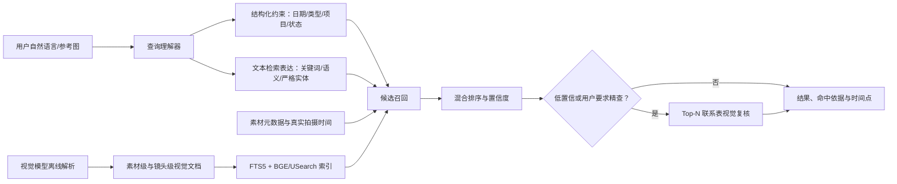

# 视觉模型辅助模糊搜索方案

## 一、任务目标

让用户只输入一句自然语言，例如：

- `昨天拍摄的素材`
- `2026 年 7 月 14 日上海拍的夜景视频`
- `找穿红色牛仔短裤的人`
- `雨夜里有人撑伞，画面偏蓝的镜头`
- `带有“新品发布”字幕的素材`
- `包含了蓝色牛仔裤的帧`

系统能够理解时间、素材类型、画面内容、同一对象属性、OCR 文本和项目范围，并在视觉接口暂时不可用时仍能退化为元数据与本地语义搜索。

结果域采用明确规则：默认只返回素材；出现“文件夹/目录”时只返回文件夹；明确出现“帧/关键帧”时返回独立帧卡片。`视频、图片`、`视频或图片` 和 `视频和图片` 在素材结果域中表示类型并集；`视频和图片所在的文件夹` 则先匹配素材条件，再返回所属文件夹。

本方案不在每次搜索时让视觉模型遍历整个素材库。视觉模型主要在素材解析阶段生成可检索事实；搜索阶段优先使用本地索引，只在结果置信度不足时对少量候选执行可选的视觉复核。

## 二、当前问题与根因

现有项目已经具备视觉逐帧解析、结构化实体/OCR、FTS5、BGE 文本向量和 USearch 向量索引，但链路存在以下缺口：

1. 查询解析后的语法词会污染关键词。`昨天拍摄的素材` 会残留 `拍摄`，随后被当作必须命中的内容词，容易返回空结果。
2. 日期条件当前过滤 `modified_at`，它是文件修改时间，不等于相机或容器记录的拍摄时间。
3. 视觉内容被聚合成单个素材级长文本，缺少镜头/帧级命中定位，长视频的局部画面容易被稀释。
4. 搜索结果没有展示“理解成了什么”、日期来源、命中帧、置信度和降级原因，用户难以判断搜不到是无素材、未解析还是模型不可用。
5. 目前只有文本向量。它能检索视觉模型生成的文字描述，但不能直接支持“拿一张参考图找相似画面”。

## 三、总体架构

## 四、模块拆分

### 模块 1：查询理解与统一检索协议

目标：把自然语言拆成可验证、可显示、可降级的检索计划。

核心字段：

- 原始查询与清洗后的语义查询。
- 日期范围、日期意图和日期来源偏好。
- 素材类型、项目、素材源、解析/确认状态。
- 结果目标（素材、文件夹或视觉帧）以及“匹配素材所在文件夹”的跨实体意图。
- 普通关键词、画面语义、OCR 意图。
- 必须由同一视觉实体满足的颜色/材质/属性约束。
- 查询解释文本与无法识别的残留词。

日期表达至少支持：今天、昨天、前天、N 天前、最近 N 天、本周、上周、完整年月日、月日、目录日期。

所有相对日期以执行搜索时的本机系统日期为基准，使用日历运算处理跨月、跨年和闰年；例如 1 月 1 日的“昨天”必须解析为上一年 12 月 31 日。

`拍摄、拍的、录制、素材、文件、帮我找` 等只表达意图的词不能成为强制内容关键词；`上海拍摄` 中的 `上海` 应保留为语义词。

### 模块 2：拍摄时间与视觉索引

拍摄时间按以下优先级归一化：

1. `com.apple.quicktime.creationdate`。
2. 图片 EXIF/容器可用的 `DateTimeOriginal` 原始拍摄时间。
3. `creation_time` 及流级创建时间。
4. 日期目录推断值。
5. 文件修改时间兜底。

数据库保存 `capture_time`、`capture_date`、`capture_time_source` 和置信度，绝不把兜底时间伪装成真实拍摄时间。

视觉索引分两层：

- 素材级文档：文件名、路径、技术元数据、摘要、关键词、场景、对象、动作、OCR、日期。
- 镜头/帧级文档：时间点、画面描述、实体事实、动作、场景、OCR，并可直接回跳预览时间点。

增量更新以素材大小、修改时间、模型 ID、提示词版本和视觉文档哈希为判定条件。未变化素材不重复调用视觉接口或重算向量。

### 模块 3：混合召回、排序与视觉复核

召回通道：

1. 结构化 SQL：日期、类型、项目和状态硬过滤。
2. FTS5：文件名、路径、OCR 和视觉事实精确召回。
3. BGE + USearch：自然语言与视觉描述的语义召回。
4. 严格实体匹配：保证“红色牛仔短裤”属于同一对象。
5. 可选多模态向量：参考图与画面相似检索。

排序采用加权融合或 RRF，不能让文件名偶然包含一个词完全压过高质量视觉命中。建议初始权重：结构化条件为硬门禁，文本语义 30%，词法 25%，视觉实体 20%，路径 10%，OCR 10%，类型/日期奖励 5%。权重应由回归查询集校准。

当 Top-1 与 Top-5 分差过小、语义最高分低或用户启用候选帧视觉复核时，把最多前 8 个候选缩略图发送给已配置的视觉接口，让模型只做候选重排和理由生成，不允许它返回候选集合之外的素材。复核结果按查询哈希、候选帧键和模型版本缓存。

### 模块 4：界面与可解释反馈

搜索框下方显示查询理解标签，例如：

- `拍摄日期：2026-07-13`
- `类型：视频`
- `画面：雨夜 / 撑伞 / 蓝色调`
- `OCR：“新品发布”`

结果卡片显示命中依据和时间点，例如：`视觉命中 00:01:24 · 红伞 / 雨夜`。日期为目录或文件时间兜底时明确标记来源。

帧结果不得复用右侧素材详情中的帧列表。进入帧结果域后，右侧详情栏隐藏，中央大操作区占满宽度，以响应式帧卡片展示缩略图、帧号、时间点、所属素材、画面描述、标签、对象、结构化实体属性、场景/动作、OCR、命中原因与置信度。点击缩略图打开大图。

空结果不能只显示“无结果”，需要区分：

- 范围内确实没有候选。
- 素材尚未完成视觉解析。
- 本地语义模型/索引不可用，已降级。
- 严格实体事实不完整，候选被排除。
- 视觉精查接口不可用，已保留本地结果。

设置页现已提供：查询辅助开关、候选帧视觉复核开关、仅本地搜索总开关、候选帧缩略图发送授权、每日搜索模型调用上限、今日用量、超时和明确的隐私提示。

## 五、文件/模块清单

优先修改：

- `src/domain/SearchTypes.h`：统一查询计划、日期约束、命中解释和置信度。
- `src/core/search/NaturalLanguageQueryParser.*`：中文日期与意图解析。
- `src/core/search/SearchEngine.*`：结构化过滤、混合召回和排序。
- `src/infrastructure/db/GlobalDatabaseManager.*`：拍摄时间、镜头搜索文档和复核缓存迁移。
- `src/application/MaterialCatalogSyncService.*`：从 ffprobe 原始 JSON 和目录元数据同步拍摄时间。
- `src/application/SearchDocumentSyncService.*`：构建素材级与镜头级视觉文档。
- `src/application/MaterialCenterQueryService.*`：装配命中帧、解释和降级状态。
- `src/ui/viewmodels/MaterialCenterViewModel.*`：查询计划与复核状态暴露。
- `src/ui/qml/workspaces/MaterialCenterWorkspace.qml`：理解标签、命中依据和视觉精查入口。

新增模块建议：

- `src/core/search/CaptureTimeResolver.*`：拍摄时间解析、优先级和来源。
- `src/core/search/VisualRerankProvider.h`：视觉复核抽象，便于测试和替换接口。
- `src/application/VisualSearchRerankService.*`：Top-N 联系表生成、调用、缓存、取消和超时。

测试：

- `NaturalLanguageQueryParserTest`：日期、意图词、残留词和冲突条件。
- `CaptureTimeResolverTest`：QuickTime、通用创建时间、时区、目录日期和修改时间兜底。
- `SearchEngineTest`：日期门禁、多路召回、排序和降级。
- `SearchDocumentSyncServiceTest`：视觉文档与增量更新。
- `MaterialCenterQueryServiceTest`：命中帧、严格实体与解释。
- `MaterialCenterUiContractTest`：查询标签、空结果原因与精查状态。

## 六、开发顺序与待办

- [x] 模块 1：修复意图词污染，建立日期范围与查询解释协议。
- [x] 模块 2A：新增真实拍摄时间字段、迁移和同步。
- [x] 模块 2B：增加镜头/帧级视觉搜索文档和增量索引。
- [x] 模块 3A：混合召回、排序、阈值、OCR 硬证据和命中解释。
- [x] 模块 3B：受约束 Top-N 视觉复核、白名单校验与会话缓存。
- [x] 模块 4A：UI 查询标签、结果依据、置信度、命中帧与空结果引导。
- [x] 模块 4C：独立帧结果域与中央大操作区帧卡片。
- [x] 模块 4B 基础能力：复用现有视觉接口配置，显示模型理解中、已辅助、缓存与失败降级状态。
- [x] 模块 4B 可选增强：独立开关、调用预算、缩略图发送授权和“仅本地搜索”显式选项。
- [x] 核心查询回归集、全量单测和 Release 构建。
- [ ] 10 万素材规模性能基准与候选包人工回归。

当前首屏搜索仍不依赖在线逐次复核：视觉模型在解析阶段生成帧级描述、实体事实与 OCR，搜索时先由本地 FTS5、BGE/USearch 与结构化 SQL 联合检索。随后已配置的视觉语言模型在后台完成两项增强：一是把自然语言转换为受白名单约束的查询建议；二是最多复核前 8 个已有帧候选。模型不能覆盖本地已识别的日期、类型和结果域，也不能返回候选集合之外的帧。模型未配置、低置信度、超时或输出校验失败时，首屏本地结果和原排序保持可用。

### 已落地的模型辅助执行链

1. 本地解析器立即识别相对日期、素材类型、文件夹/素材/帧结果域、OCR 与同实体条件。
2. 本地混合检索立即返回首屏结果，不等待网络模型。
3. 视觉语言模型异步返回 `material_search_understanding_v1` 查询建议；协议包含版本、结果域、语义词、素材类型、日期范围、OCR、实体属性、置信度和解释。
4. 合并器坚持本地硬条件优先，只补充本地未识别的语义和结构化条件；低于 0.55 置信度不应用。
5. 帧结果模式最多发送前 8 个候选缩略图进行 `material_frame_rerank_v1` 复核。返回 ID 必须属于候选白名单，虚构 ID 和重复 ID直接丢弃。
6. 复核只调整已有帧的顺序、置信度和理由；未复核帧继续保留，失败时完整保留原排序。
7. 查询理解缓存最多 64 条、帧复核缓存最多 32 条；缓存键包含协议版本、查询、模型和候选帧键。
8. 连续输入通过查询代次隔离，旧请求晚返回时不会覆盖新搜索。

### 已落地的用户控制、隐私与预算门禁

1. `searchAssistantEnabled` 独立控制自然语言查询辅助，关闭后继续使用本地查询理解；帧复核仍可独立运行。
2. `frameRerankEnabled` 独立控制候选帧视觉复核，关闭后完整保留本地帧排序。
3. `localOnlySearch` 是最高优先级总开关。启用后查询文字与候选帧都不会通过搜索链路发起模型网络请求。
4. `allowSearchFrameUpload` 单独授权候选帧缩略图发送；查询理解只发送文字，不受该授权影响。
5. 每日搜索模型调用预算默认 100 次，范围 0～10000；`0` 表示不限额，计数按本机日期切换。
6. 只有即将发起的真实网络请求才计 1 次；网络失败仍计数，查询理解和帧复核分别计数，缓存命中与在途请求复用不计数。
7. 门禁顺序为：仅本地搜索 ＞ 对应功能开关 ＞ 缩略图发送授权（仅帧复核）＞ 缓存/在途复用 ＞ 每日预算 ＞ 模型配置完整性。
8. 预算检查分为只读可用性判断和请求前原子扣减：配置缺失不会误扣预算；预算耗尽时优先显示预算状态，并保留本地结果。
9. 设置保存后通过 `searchSettingsChanged` 立即触发当前搜索重载，不需要重启应用。

## 七、验收标准

1. `昨天拍摄的素材` 不再把“拍摄”作为强制关键词，并能返回日期匹配素材。
2. `昨天拍摄的视频、图片` 只返回前一天的视频或图片，不返回音频、文档或文件夹。
3. `昨天的文件夹` 只返回目录日期匹配的文件夹；`视频和图片所在的文件夹` 返回符合素材条件的所属文件夹。
4. 有容器拍摄时间时按真实拍摄时间过滤；只有文件时间时仍可返回，但 UI 标注“文件时间兜底”。
5. `找穿红色牛仔短裤的人` 只返回同一实体同时满足颜色、材质和类别的完整结构化事实。
6. `雨夜里有人撑伞` 能召回文件名完全不含这些词、但视觉解析内容匹配的素材。
7. OCR 与帧级视觉查询能返回具体时间点；选择素材后，匹配帧会进入详情首屏并标记“视觉语义命中”。
8. 视觉接口断网时，本地元数据、FTS5 和 BGE 搜索仍可用，并显示降级原因。
9. 视觉复核只能重排本地候选，不得凭空生成素材；超时可取消并保留原排序。
10. 10 万素材规模下，已建索引的普通搜索目标 P95 小于 500 ms；视觉复核独立异步完成，不阻塞首屏结果。
11. 所有新增迁移兼容旧库，关闭本地语义或视觉能力后软件仍可启动和检索。
12. `包含了蓝色牛仔裤的帧` 只返回满足条件的帧卡片；结构化事实完整时颜色、材质和裤子必须属于同一视觉实体，旧数据只能以同一帧文本证据低置信度兜底；结果在中央大操作区显示，右侧详情栏隐藏。
13. 开启“仅本地搜索”后，查询理解与候选帧复核都必须在模型配置和预算检查之前停止，不发送文字或缩略图。
14. 缓存命中不得消耗每日调用预算；预算耗尽、模型未配置、缩略图未授权或功能关闭时均保留本地搜索结果和原排序。
15. `AppSettingsBudgetTest` 覆盖默认值、`0` 不限额、有限预算耗尽、跨日期归零和设置持久化；UI 契约测试覆盖设置属性、隐私文案、保存参数顺序与两条门禁链。
16. Windows MSVC Release 全量构建成功且 CTest 27/27 通过。`v0.1.147` 已发布到 GitHub Releases；安装包 187,092,974 字节，SHA-256 `48887B0737D7397FC566395AEF6783D5E7B78C317A5674049E260E3B49A3F666`，包含 ONNX Runtime、BGE 模型、Qt 运行库与 FFmpeg CLI。

## 八、实施决策

第一阶段优先修复查询理解和真实拍摄时间，因为它们直接解决“某天拍摄的素材”。现有视觉模型继续负责把画面转成结构化事实与文本索引。第二阶段再增加镜头级文档和可选视觉复核；第三阶段如需要“以图搜图”，再加入独立的图文多模态向量模型，避免把文本 BGE 与视觉向量混在同一索引中。

## 九、发布记录

### v0.1.147（2026-07-14）

- GitHub Release：`https://github.com/luojiang419/dit-tools/releases/tag/v0.1.147`
- 源码标签提交：`3aefb80b439fe22537445faf9040e1fc545511a6`
- 安装包：`CineVault-Setup-v0.1.147.exe`
- 大小：187,092,974 字节。
- SHA-256：`48887B0737D7397FC566395AEF6783D5E7B78C317A5674049E260E3B49A3F666`。
- 发布前修复了标准打包脚本遗漏 ONNX Runtime 与 BGE 模型资产的问题；脚本现在要求 DLL 与模型目录成对存在，否则拒绝生成安装包。
- GitHub `releases/latest`、资产元数据、公开下载重定向和最终 `200 OK` 均已验证。
