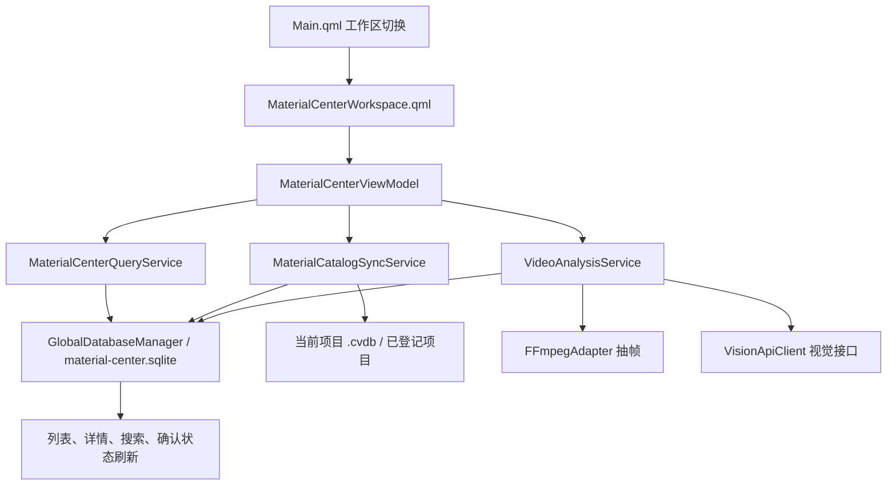

# 素材管理中心页面功能流程与实现逻辑

更新时间：2026-06-26  
分析基线：进度快照 `047-素材管理中心批量解析弹窗.md`

## 1. 页面定位

素材管理中心是一个跨项目的视频素材语义索引页面。它不同于普通“素材库”只查看当前项目文件，而是把已登记项目中的视频同步到全局数据库，再对视频抽帧、调用视觉模型生成逐帧描述和视频摘要，最后支持按项目、素材源、解析状态、确认状态和语义关键词检索。

当前页面主要解决四类工作：

1. 将当前项目或已登记项目的视频同步到全局素材索引。
2. 浏览、搜索和筛选全局视频素材。
3. 对单个或当前筛选结果中的视频执行视觉解析。
4. 查看解析摘要、关键词、逐帧结果，并确认解析结果。

## 2. 相关文件与模块清单

| 层级 | 文件 | 作用 |
| --- | --- | --- |
| 页面入口 | `src/ui/qml/Main.qml` | 根据当前工作区加载 `MaterialCenterWorkspace`；进入素材管理中心时隐藏左侧素材源栏和右侧检查器。 |
| 顶部导航 | `src/ui/viewmodels/ShellViewModel.*` | 提供“素材管理中心”标签页；全局搜索按当前工作区转发给素材管理中心或素材库。 |
| 页面 UI | `src/ui/qml/workspaces/MaterialCenterWorkspace.qml` | 顶部工具条、筛选区、结果列表、详情面板、批量解析弹窗、解析图片全屏查看。 |
| 页面状态 | `src/ui/viewmodels/MaterialCenterViewModel.*` | 承接 QML 调用，维护筛选条件、当前选中素材、状态文本、消息、解析进度和队列状态。 |
| 列表模型 | `src/ui/models/MaterialCenterListModel.*` | 将 `GlobalVideoAsset` 暴露给 QML ListView，包括文件名、摘要、关键词、状态、缩略图等角色。 |
| 查询服务 | `src/application/MaterialCenterQueryService.*` | 从全局库查询项目选项、素材源选项、素材列表和视频详情；支持 FTS5 或 LIKE 检索。 |
| 同步服务 | `src/application/MaterialCatalogSyncService.*` | 将项目库中的视频同步到全局库；支持同步当前项目和重建所有已登记项目。 |
| 解析服务 | `src/application/VideoAnalysisService.*` | 管理解析队列，抽帧、调用视觉接口、写入逐帧结果和摘要，处理确认。 |
| 视觉接口 | `src/infrastructure/network/VisionApiClient.*` | 使用 OpenAI-compatible `/chat/completions` 接口分析帧图和汇总视频。 |
| 抽帧接口 | `src/infrastructure/ffmpeg/FFmpegAdapter.*` | 检测 FFmpeg/ffprobe，读取帧时间戳并抽取 JPEG 帧图。 |
| 全局数据库 | `src/infrastructure/db/GlobalDatabaseManager.*` | 打开 `material-center.sqlite`，创建全局索引表、解析结果表、逐帧表和可选 FTS5 表。 |
| 设置 | `src/infrastructure/config/AppSettings.*`、`src/ui/viewmodels/SettingsViewModel.*`、`src/ui/qml/components/SettingsDialog.qml` | 保存视觉接口参数、抽帧策略、超时和解析图片目录信息。 |
| 路径 | `src/shared/Paths.*` | 解析图片目录位于 `resolvedDataRoot()/frame-cache/<videoKey>`。 |
| 格式化 | `src/shared/Formatters.*` | 解析状态、确认状态、时长等中文展示文本。 |

## 3. 总体实现链路

核心原则是：页面不直接访问数据库，QML 只调用 ViewModel；ViewModel 负责状态编排；查询、同步、解析分别由独立服务完成；全局素材中心的数据统一落在全局 SQLite 数据库。

## 4. 页面工作流程

### 4.1 进入页面

用户在顶部工作区切到“素材管理中心”后：

1. `ShellViewModel::setCurrentWorkspace()` 将当前工作区设为 `WorkspaceId::MaterialCenter`。
2. `Main.qml` 的 `Loader` 加载 `MaterialCenterWorkspace`。
3. `Main.qml` 同时隐藏 `SourceRail` 和 `InspectorPane`，素材管理中心独占主工作区。
4. `MaterialCenterWorkspace.qml` 在 `Component.onCompleted` 调用 `viewModel.reload()`。
5. `MaterialCenterViewModel::reload()` 拉取项目选项、素材源选项和当前素材列表。
6. 如果当前没有选中项且列表不为空，默认选中第一条视频并读取详情。

### 4.2 顶部工具条

页面顶部有四个主要操作：

| 按钮 | QML 调用 | 实现行为 |
| --- | --- | --- |
| 同步当前项目 | `syncCurrentProject()` | 将当前打开项目的视频同步到全局素材中心。 |
| 批量解析 | `analyzeVisiblePending()` 或弹窗后 `analyzeVisibleAll()` | 对当前搜索/筛选结果入队解析。已有解析完成素材时先弹窗选择策略。 |
| 重建全局索引 | `rebuildGlobalIndex()` | 遍历全局库中已登记项目，重新同步各项目视频。 |
| 全部确认 | `confirmVisible()` | 将当前结果中未确认素材批量标记为已确认。 |

### 4.3 搜索与筛选

页面筛选区包含：

1. 搜索框：绑定 `shellVm.globalSearchText`，由 `ShellViewModel::searchRequested` 转发到 `MaterialCenterViewModel::setSearchText()`。
2. 项目下拉框：调用 `setProjectFilter(projectUuid)`，切换项目时会清空素材源筛选。
3. 素材源下拉框：调用 `setSourceFilter(sourceName)`。
4. 解析状态下拉框：调用 `setAnalysisStatusFilter(status)`，包含全部、待解析、解析中、已解析、解析失败。
5. 确认状态下拉框：调用 `setConfirmationStatusFilter(status)`，包含全部、未确认、已确认。

每次筛选条件变化都会触发 `reload()`，重新查询列表、刷新状态文本和当前详情。

### 4.4 左侧结果列表

列表由 `MaterialCenterListModel` 提供数据，QML 展示：

1. 缩略图或“暂无缩略图”占位。
2. 文件名、项目名、素材源名。
3. 视频摘要，未解析时显示“尚未生成视频内容摘要”。
4. 失败原因，来自 `errorMessage`。
5. 关键词、解析状态、确认状态。
6. 单条“确认”按钮，已确认后显示“已确认”且不可点击。

点击列表卡片会调用 `selectVideo(videoKey)`，读取并刷新右侧详情。点击缩略图会打开全屏图片查看层。

### 4.5 右侧详情面板

右侧详情展示当前选中视频的完整语义信息：

1. 标题、项目名、素材源名、缩略图。
2. 单视频“开始解析/重试解析/重新解析”按钮。
3. “打开所属项目”和“定位文件夹”按钮。
4. 解析进度卡片，包括进度文案、百分比、进度条和失败原因。
5. 视频摘要。
6. 关键词与解析/确认状态。
7. 源文件路径和解析图片目录。
8. 逐帧解析结果，包括帧图、帧号、时间戳、描述、标签、对象。

右侧详情来自 `MaterialCenterViewModel::refreshDetail()`，底层由 `MaterialCenterQueryService::fetchDetail(videoKey)` 同时读取 `global_video_asset`、`video_analysis_result` 和 `video_frame_analysis`。

### 4.6 解析图片查看

页面内置图片查看层：

1. 列表缩略图、右侧缩略图、逐帧图片都可点击打开。
2. 查看层使用黑色覆盖层，支持鼠标拖拽平移、滚轮缩放、双击重置、Esc 或右上角关闭。
3. 图片路径通过 `file:///` 加载本地文件。

## 5. 素材同步流程

素材管理中心依赖全局库，视频进入全局库的路径有两类：自动同步和手动同步。

### 5.1 自动同步触发点

`AppContext.cpp` 中将多个事件连接到 `MaterialCatalogSyncService::syncCurrentProject()`：

1. 打开或切换项目后。
2. 导入素材源后。
3. 媒体元数据或缩略图任务完成后。
4. 素材库数据变化后。

这样普通素材库发生变化后，素材管理中心的全局索引会尽量跟随更新。

### 5.2 手动同步当前项目

用户点击“同步当前项目”后：

1. `MaterialCenterViewModel::syncCurrentProject()` 调用 `MaterialCatalogSyncService::syncCurrentProject()`。
2. 服务检查是否已有同步任务在运行、全局库是否存在、当前是否打开项目。
3. 创建 `JobType::GlobalSync` 任务。
4. 在线程中打开全局库连接。
5. 读取当前项目数据库中的视频素材：
   - `asset_file`
   - `source_root`
   - `media_metadata`
   - `thumbnail`
6. 生成全局视频键：`<projectUuid>:<assetId>`。
7. 写入或更新 `global_video_asset`。
8. 更新 `project_registry`。
9. 成功后发出 `catalogChanged()`，页面收到后自动 `reload()`。

### 5.3 同步时的保留与清理策略

同步服务会加载同项目已有的全局素材状态，然后按视频大小和修改时间判断素材是否变化：

1. 视频未变化：保留原有 `analysis_status`、`confirmation_status` 和 `error_message`。
2. 视频新增或发生变化：状态重置为待解析、未确认，并删除旧的逐帧记录、摘要记录和 FTS 记录。
3. 项目中已经不存在的视频：从 `global_video_asset` 删除，同时删除对应 FTS 记录。

这保证了“同一个文件没变就不丢解析结果，文件变了就重新解析”。

### 5.4 重建全局索引

点击“重建全局索引”后：

1. `MaterialCenterViewModel::rebuildGlobalIndex()` 调用 `MaterialCatalogSyncService::rebuildAllProjects()`。
2. 服务从 `project_registry` 读取所有已登记项目。
3. 逐个打开项目数据库并执行同步。
4. 任务进度按项目数量推进。
5. 单个项目失败会记录到该项目的 `project_registry.sync_status` 和 `error_message`，总体任务仍会汇总成功和失败数量。

## 6. 查询与检索逻辑

`MaterialCenterQueryService::fetchAssets()` 负责列表查询：

1. 主表是 `global_video_asset g`。
2. 左连接 `video_analysis_result r`，用于拿摘要、关键词、场景、搜索文本、解析时间和确认时间。
3. 项目筛选使用 `g.project_uuid = ?`。
4. 素材源筛选使用 `g.source_root_name = ?`。
5. 解析状态筛选使用 `g.analysis_status = ?`。
6. 确认状态筛选使用 `g.confirmation_status = ?`。
7. 关键词检索优先使用 FTS5：
   - `video_search_fts MATCH ?`
   - 同时 fallback 到 `search_text`、文件名、项目名、素材源名的 LIKE。
8. 如果当前 SQLite 不支持 FTS5，则只使用 LIKE。
9. 结果排序为 `updated_at DESC`，再按项目名和文件名排序。
10. 当前实现最多返回 2000 条。

详情查询 `fetchDetail(videoKey)` 会读取单条全局素材和该视频的全部逐帧记录。

## 7. 单视频解析流程

### 7.1 入队前校验

用户点击右侧“开始解析/重试解析/重新解析”后，`MaterialCenterViewModel::analyzeSelected()` 调用 `VideoAnalysisService::enqueueVideo()`。

入队前 `validateReadyForEnqueue()` 会校验：

1. `videoKey` 非空。
2. 全局素材中心数据库已打开。
3. FFmpeg/ffprobe 可用。
4. 视觉解析客户端存在。
5. 设置中已填写 Base URL、API Key 和模型名。
6. 当前视频不在运行中或等待队列中。

校验失败时，页面会在消息区和进度区显示错误。

### 7.2 队列模型

解析队列由 `VideoAnalysisService` 内部维护：

1. `m_analysisQueue` 保存等待解析的视频键。
2. `m_queuedVideoKeys` 用于去重。
3. `m_currentVideoKey` 保存当前正在解析的视频。
4. `m_analysisRunning` 保证同一时间只解析一个视频。

入队后会发出：

1. `analysisProgressChanged(videoKey, 0, "等待解析队列", Pending, "")`
2. `analysisQueueChanged(currentVideoKey, queuedCount)`

页面通过这两个信号刷新按钮文案、进度条和队列数量。

### 7.3 实际解析步骤

`startNextAnalysis()` 会启动一个 `QtConcurrent::run` 后台任务：

1. 创建 `JobType::ContentAnalysis` 任务。
2. 在线程内打开全局数据库连接。
3. 读取 `global_video_asset` 中的视频文件信息。
4. 删除旧解析产物：
   - `video_frame_analysis`
   - `video_analysis_result`
   - `video_search_fts`
5. 将 `global_video_asset.analysis_status` 设置为 `Running`，确认状态设为 `Pending`。
6. 清理该视频的解析图片目录：`Paths::frameCacheDirectory(videoKey)`。
7. 调用 `FFmpegAdapter::extractFrames()` 抽帧。
8. 抽帧成功后先把帧号、时间戳和图片路径写入 `video_frame_analysis`。
9. 对每一帧调用 `VisionApiClient::analyzeFrame()`。
10. 每帧完成后更新该帧的描述、标签、对象、动作、场景或错误信息。
11. 按帧解析进度更新任务和页面进度，范围大致为 10% 到 85%。
12. 至少有一帧成功后，调用 `VisionApiClient::summarizeVideo()` 汇总视频。
13. 写入 `video_analysis_result`。
14. 更新 `global_video_asset.analysis_status = Ready`，`confirmation_status = Pending`。
15. 如果支持 FTS5，重建该视频的 `video_search_fts` 记录。
16. 发出 `catalogChanged()`，页面重新加载列表和详情。

### 7.4 抽帧逻辑

`FFmpegAdapter::extractFrames()` 的流程是：

1. 先用 ffprobe 读取视频第一路视频流的全部帧时间戳。
2. 根据设置选择帧：
   - `EveryFrame`：逐帧解析，间隔为 1。
   - `EveryNFrames`：每 N 帧抽 1 帧，N 来自 `frameInterval`，默认 10。
3. 对每个选中的时间戳调用 ffmpeg 生成单张 JPEG。
4. 输出文件名形如 `frame_000001.jpg`。
5. 默认最大宽高是 1920x1080，保持原始宽高比缩放。

### 7.5 视觉接口逻辑

`VisionApiClient` 使用 OpenAI-compatible Chat Completions 接口：

1. Base URL 会自动规范化：
   - 裸域名补 `http://`。
   - `/v1` 后补 `/chat/completions`。
   - 根路径补 `/v1/chat/completions`。
2. 请求头使用 `Authorization: Bearer <apiKey>`。
3. 帧解析请求包含中文 prompt 和 base64 图片，要求返回 JSON：
   - `caption`
   - `tags`
   - `objects`
   - `actions`
   - `setting`
4. 汇总请求把成功帧的描述、标签、对象、动作、场景拼成文本，要求返回 JSON：
   - `summary`
   - `keywords`
   - `scenes`
5. 默认使用 `response_format: json_object`，如果接口 400 且拒绝 `response_format`，会退回 text 格式再请求。
6. 返回结果会从 assistant message 中提取 JSON，并对常见字段别名、字符串/数组混用做归一化；如果首次无法解析 JSON 或归一化后为空，会把原始返回内容再发送一次轻量格式修复请求，要求模型转换为目标 JSON；如果修复仍失败但原始返回文本非空，则将原始文本兜底写入帧描述或视频摘要，保证后续仍可搜索。

### 7.6 失败处理

解析过程中任一步失败都会：

1. 尽量把 `global_video_asset.analysis_status` 写为 `Failed`。
2. 将 `confirmation_status` 保持为 `Pending`。
3. 写入 `error_message`。
4. 标记任务失败。
5. 发出页面进度失败信号。
6. 发出 `catalogChanged()` 刷新列表。

如果部分帧失败但仍有成功帧，视频仍可完成解析，完成文案会显示成功帧数和失败帧数。

## 8. 批量解析流程

顶部“批量解析”只作用于当前搜索和筛选结果，也就是 `m_assets`。

当前逻辑：

1. 如果当前结果中没有已解析素材，点击后直接调用 `analyzeVisiblePending()`。
2. 如果当前结果中存在已解析素材，先打开批量解析弹窗。
3. 弹窗选择“解析未完成素材”时，调用 `analyzeVisiblePending()`：
   - 只收集 `Pending` 和 `Failed` 状态的视频。
   - 已解析、解析中素材不重新入队。
4. 弹窗选择“全部重新解析”时，调用 `analyzeVisibleAll()`：
   - 收集当前结果的全部视频。
   - 已解析素材会重新入队，解析开始时旧结果会被覆盖。
5. 入队由 `VideoAnalysisService::enqueueVideos()` 逐条调用 `enqueueVideo()`，重复项或已在队列中的视频会被拒绝。

这正是快照 047 中完成的交互：当当前结果中已经有解析完成素材时，给用户选择“只补未完成”还是“全部重跑”。

## 9. 确认流程

确认用于表示当前解析结果已经被人工接受。

入口有两处：

1. 列表每条卡片上的“确认”按钮调用 `confirmVideo(videoKey)`。
2. 顶部“全部确认”调用 `confirmVisible()`。

服务层逻辑：

1. `MaterialCenterViewModel` 调用 `VideoAnalysisService::confirmVideo()` 或 `confirmVideos()`。
2. `VideoAnalysisService` 去重后开启数据库事务。
3. 更新 `video_analysis_result.confirmed_at`。
4. 更新 `global_video_asset.confirmation_status = Confirmed`。
5. 清空 `global_video_asset.error_message`。
6. 提交事务后发出 `catalogChanged()`。

确认不会删除帧图。页面文案“解析图片将永久保留”的实际含义是：确认操作本身不清理解析图片，后续查看仍可从 `frame-cache/<videoKey>` 读取帧图。重新解析同一视频时会先清理该视频的旧帧图目录。

## 10. 状态模型

### 10.1 解析状态

| 枚举 | 数值 | 展示文本 | 含义 |
| --- | --- | --- | --- |
| `VideoAnalysisStatus::Pending` | 0 | 待解析 | 已同步到全局库，但尚未执行视觉解析。 |
| `VideoAnalysisStatus::Running` | 1 | 解析中 | 后台解析任务正在处理该视频。 |
| `VideoAnalysisStatus::Ready` | 2 | 待确认或已确认 | 解析成功，具体显示取决于确认状态。 |
| `VideoAnalysisStatus::Failed` | 3 | 解析失败 | 抽帧、接口调用、汇总或数据库写入失败。 |

### 10.2 确认状态

| 枚举 | 数值 | 展示文本 | 含义 |
| --- | --- | --- | --- |
| `ConfirmationStatus::Pending` | 0 | 未确认 | 解析结果尚未被人工确认。 |
| `ConfirmationStatus::Confirmed` | 1 | 已确认 | 解析结果已被人工确认。 |

`Formatters::videoAnalysisStatusLabel()` 对已解析素材做了特殊展示：如果 `analysis_status = Ready` 且 `confirmation_status = Confirmed`，显示“已确认”；否则显示“待确认”。

## 11. 全局数据库结构

全局库文件由 `GlobalDatabaseManager` 创建，路径是：

`Paths::resolvedDataRoot()/material-center.sqlite`

主要表：

| 表 | 作用 |
| --- | --- |
| `project_registry` | 记录已同步项目的 UUID、名称、项目数据库路径、最近同步时间、同步状态和错误。 |
| `global_video_asset` | 全局视频索引主表，记录项目、素材源、文件路径、缩略图、时长、解析状态、确认状态等。 |
| `video_analysis_result` | 单视频汇总结果，记录摘要、关键词、场景、搜索文本、模型名、prompt 版本、解析时间、确认时间。 |
| `video_frame_analysis` | 逐帧解析结果，记录帧号、时间戳、帧图路径、描述、标签、对象、动作、场景和错误。 |
| `video_search_fts` | 可选 FTS5 虚拟表，用于摘要、关键词、帧描述等语义搜索。SQLite 不支持 FTS5 时会自动降级为 LIKE。 |

关键索引：

1. `idx_global_video_project`：按项目过滤。
2. `idx_global_video_source`：按素材源过滤。
3. `idx_global_video_status`：按解析状态和确认状态过滤。
4. `idx_frame_video_key`：按视频读取逐帧结果。

## 12. 配置与路径

视觉解析配置来自 `AppSettings`，通过设置弹窗维护：

| 配置 | Key | 默认值 |
| --- | --- | --- |
| Base URL | `materialCenter/visionBaseUrl` | 空 |
| API Key | `materialCenter/visionApiKey` | 空 |
| 模型名 | `materialCenter/visionModel` | `gpt-4.1-mini` |
| 抽帧模式 | `materialCenter/analysisMode` | 每 N 帧抽 1 帧 |
| 抽帧间隔 | `materialCenter/frameInterval` | 10 |
| 缩略图帧序号 | `materialCenter/thumbnailFrameIndex` | 3 |
| 解析超时 | `materialCenter/analysisTimeoutSec` | 60 秒 |

解析图片路径：

1. 根目录：`Paths::frameCacheRoot()`，即 `resolvedDataRoot()/frame-cache`。
2. 单视频目录：`Paths::frameCacheDirectory(videoKey)`。
3. `videoKey` 中的 `:`、`/`、`\` 会被替换为 `_`，避免非法路径字符。

## 13. 当前实现限制与注意点

1. 当前解析队列是串行处理，同一时间只解析一个视频。
2. 解析任务没有用户可见的取消入口。
3. 查询结果固定限制为 2000 条。
4. 素材源筛选按 `source_root_name` 过滤，不按 `source_root_id`，不同项目中同名素材源在不选择项目时会合并筛选。
5. 全局库打开失败目前没有明显页面级错误提示，可能导致列表为空或解析入队提示数据库未打开。
6. “全部确认”会确认当前筛选结果中所有未确认素材，并不强制要求解析状态为 Ready。
7. 重新解析会覆盖旧摘要、旧逐帧记录、旧 FTS 记录，并清理该视频旧帧图目录。
8. 同步发现视频文件大小或修改时间变化时，会清理数据库中的旧解析结果，但当前代码没有同步删除对应帧图目录。
9. 设置页目前可以刷新解析图片占用信息，但没有直接清理按钮；底层 `Paths::clearFrameCache()` 已存在。
10. 视觉接口依赖返回可解析 JSON，模型输出不规范会导致该帧或汇总失败。

## 14. 建议验收场景

1. 打开已有项目后进入素材管理中心，验证页面会自动加载全局素材列表。
2. 新增素材源并等待媒体任务完成，验证全局索引自动同步。
3. 搜索文件名、项目名、素材源名、已解析摘要和关键词，验证结果刷新。
4. 用项目、素材源、解析状态、确认状态组合筛选，验证状态文本统计正确。
5. 对待解析视频执行单视频解析，验证队列、进度、帧图、摘要、关键词、状态变化。
6. 故意配置错误 API Key 或不可用模型，验证失败原因写入并可重试。
7. 当前结果无已解析素材时点击“批量解析”，验证直接入队。
8. 当前结果混有已解析素材时点击“批量解析”，验证弹窗出现。
9. 在弹窗中选择“解析未完成素材”，验证已解析素材不重跑。
10. 在弹窗中选择“全部重新解析”，验证当前结果全部重新入队并覆盖旧解析。
11. 点击单条确认和全部确认，验证确认状态刷新，解析图片仍可打开。
12. 点击缩略图或帧图，验证全屏查看、滚轮缩放、拖拽平移和 Esc 关闭。
